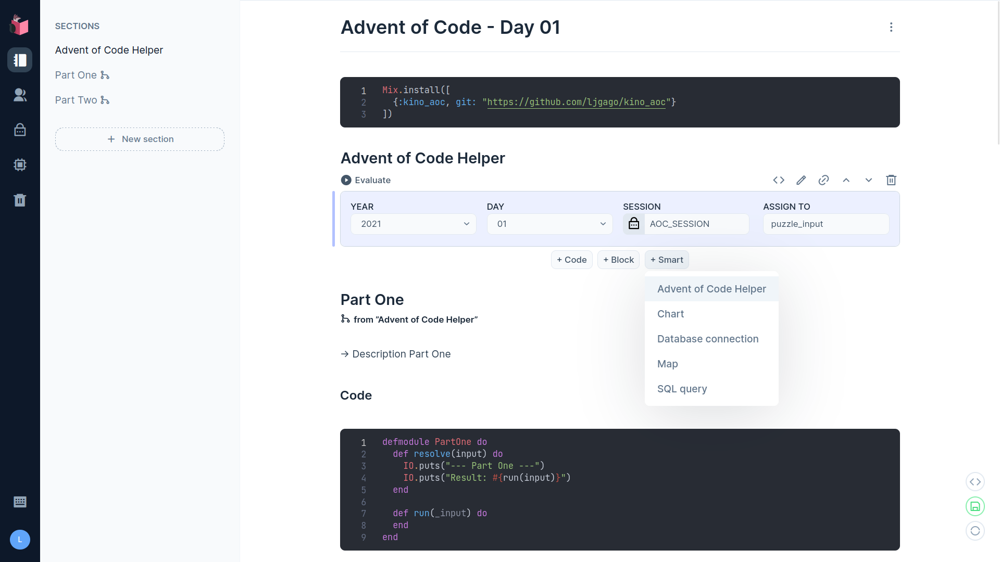

# KinoAOC

A helper for Advent of Code (a smart cell) for Elixir [Livebook](https://github.com/livebook-dev/livebook) using [Kino](https://github.com/livebook-dev/kino).

## Installation

To bring KinoAOC to Livebook all you need to do is `Mix.install/2`:

```elixir
Mix.install([
  {:kino_aoc, "~> 0.1"}
])
```

## Usage

You only need add the smart cell `Advent of Code Helper` and select the `YEAR`,
`DAY`, set the `SESSION` and the output `ASSIGN TO`.



In `SESSION` you can configure a `secret` or set a `string` directly.
The session id is a cookie which is set when you login to AoC. You can
find it with your browser inspector.

> **Warning** <br/>
> The session string mode saves the content directly in the notebook. <br/>
> Be careful to share it.

## Example template

A [template](priv/livebook/aoc_template.livemd) that you can use.

## License

[MIT License](LICENSE)
